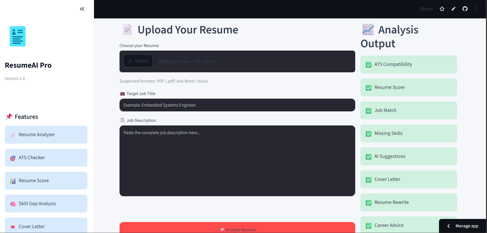
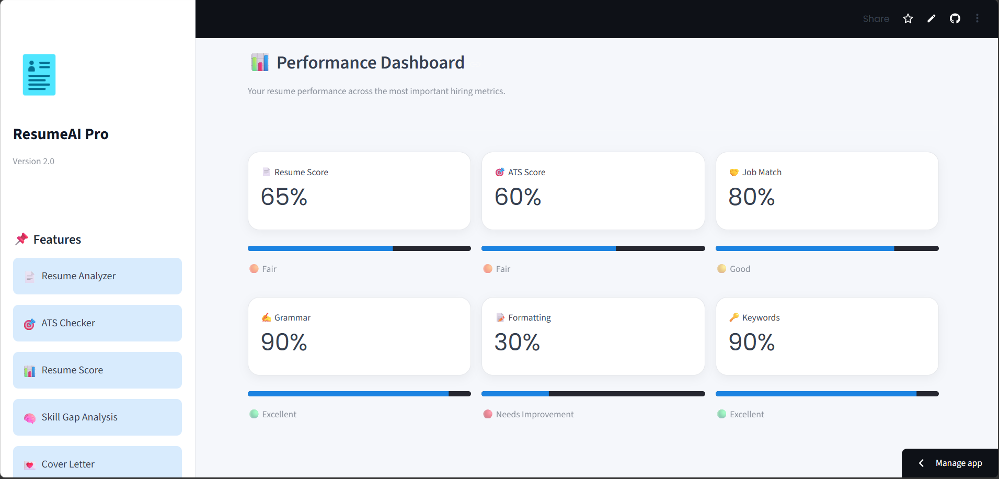
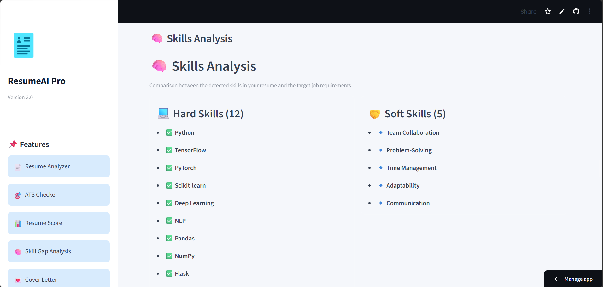
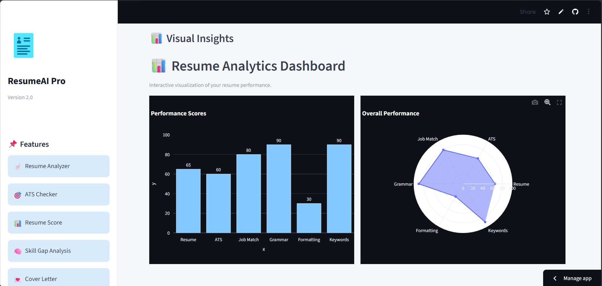
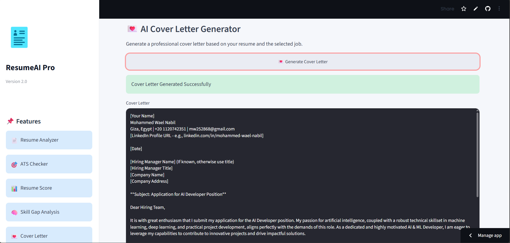
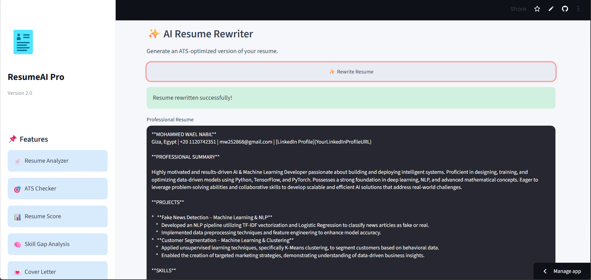
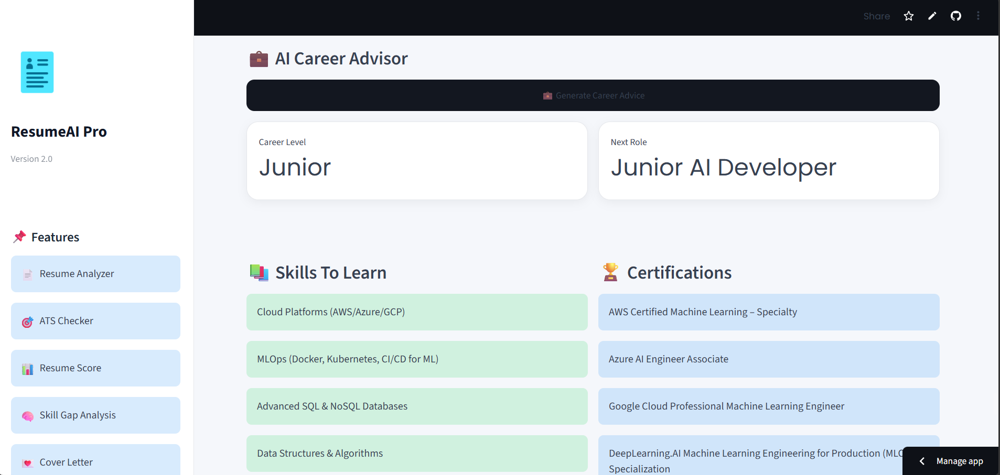
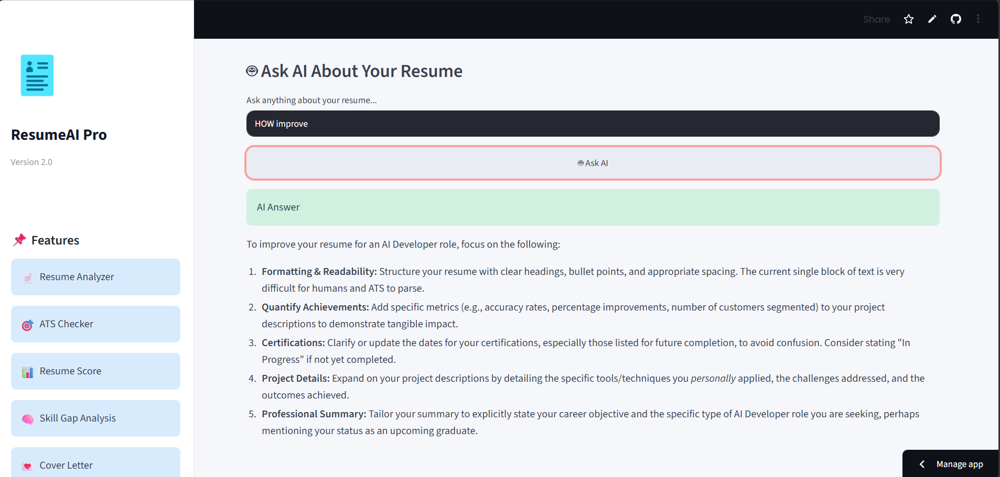

# 🚀 ResumeAI Pro

<p align="center">


</p>

<p align="center">

### AI-powered Resume Analyzer & Career Assistant

Analyze resumes, evaluate ATS compatibility, match resumes with job descriptions, generate professional cover letters, rewrite resumes, create LinkedIn summaries, receive career guidance, chat with your resume, and export professional PDF reports using **Google Gemini AI**.

</p>

<p align="center">

🌐 **Live Demo**

https://phantommw-resumeai.streamlit.app/

</p>

---

# 📖 Overview

ResumeAI Pro is an intelligent AI-powered web application developed using **Python**, **Streamlit**, and **Google Gemini AI**.

It helps job seekers improve their resumes by providing comprehensive AI analysis, ATS optimization, skill gap detection, career recommendations, interview preparation, and document generation.

The project combines modern AI technologies with an interactive dashboard to create a complete resume optimization platform.

---

# 📸 Application Preview

## 🏠 Home Page

<p align="center">

</p>

---

## 📄 Upload Resume

<p align="center">

</p>

---

## 📊 Resume Dashboard

<p align="center">

</p>

---

## 🧠 Skills Analysis

<p align="center">

</p>

---

## 📈 Interactive Charts

<p align="center">

</p>

---

## 💌 Cover Letter Generator

<p align="center">

</p>

---

## ✨ Resume Rewriter

<p align="center">

</p>

---

## 💼 Career Advisor

<p align="center">

</p>

---

## 🤖 Resume AI Chat

<p align="center">

</p>

---

# 📸 Application Preview

## 🏠 Home

<p align="center">
  
</p>

---

## 📄 Upload Resume

<p align="center">
  
</p>

---

## 📊 Dashboard

<p align="center">
  
</p>

---

## 🧠 Skills Analysis

<p align="center">
  
</p>

---

## 📈 Analytics

<p align="center">
  
</p>

---

## 💌 Cover Letter Generator

<p align="center">
  
</p>

---

## ✨ Resume Rewriter

<p align="center">
  
</p>

---

## 💼 Career Advisor

<p align="center">
  
</p>

---

## 🤖 Resume Chat

<p align="center">
  
</p>

---

# ✨ Features

- ✅ Resume Analysis
- ✅ ATS Compatibility Score
- ✅ Resume Quality Score
- ✅ Job Match Analysis
- ✅ Grammar Evaluation
- ✅ Formatting Analysis
- ✅ Keyword Analysis
- ✅ Hard Skills Detection
- ✅ Soft Skills Detection
- ✅ Missing Skills Detection
- ✅ AI Hiring Decision
- ✅ Professional Resume Summary
- ✅ AI Resume Rewriter
- ✅ AI Cover Letter Generator
- ✅ AI Career Advisor
- ✅ AI LinkedIn Summary Generator
- ✅ Resume AI Chat
- ✅ Professional PDF Report
- ✅ Analysis History

---

# 🛠 Tech Stack

| Category | Technology |
|------------|------------|
| Language | Python |
| Framework | Streamlit |
| AI | Google Gemini |
| Charts | Plotly |
| PDF Parsing | PDFPlumber |
| DOCX Parsing | python-docx |
| Reports | ReportLab |
| Environment | python-dotenv |

---

# 📂 Project Structure

```text
ResumeAI-Pro/

├── assets/
│   └── screenshots/

├── components/
│   ├── charts.py
│   ├── dashboard.py
│   ├── decision.py
│   ├── interview.py
│   ├── metrics.py
│   ├── reviews.py
│   └── skills.py

├── images/

├── analyzer.py
├── app.py
├── career_advisor.py
├── config.py
├── cover_letter.py
├── gemini_client.py
├── history.py
├── history.json
├── linkedin_summary.py
├── parser.py
├── prompts.py
├── report.py
├── requirements.txt
├── results.py
├── resume_chat.py
├── rewrite.py
├── ui.py
├── utils.py

└── README.md
```
---

# ⚙️ Installation

## 1️⃣ Clone the Repository

```bash
git clone https://github.com/PhantomMW/ResumeAI-Pro.git
```

---

## 2️⃣ Navigate to the Project

```bash
cd ResumeAI-Pro
```

---

## 3️⃣ Install Dependencies

```bash
pip install -r requirements.txt
```

---

## 4️⃣ Create Environment File

Create a file named `.env`

```env
GEMINI_API_KEY=YOUR_API_KEY
```

---

## 5️⃣ Run the Application

```bash
streamlit run app.py
```

The application will start locally at:

```
http://localhost:8501
```

---

# 🚀 Live Demo

🌐 **Streamlit Community Cloud**

https://phantommw-resumeai.streamlit.app/

---

# 🤖 AI Capabilities

ResumeAI Pro utilizes **Google Gemini AI** to deliver intelligent resume analysis and career assistance.

### AI Features

- Resume Analysis
- ATS Compatibility Evaluation
- Resume Quality Assessment
- Job Matching
- Missing Skills Detection
- Hard & Soft Skills Identification
- Resume Improvement Suggestions
- Professional Resume Summary
- AI Hiring Decision
- Resume Rewriting
- Cover Letter Generation
- LinkedIn Summary Creation
- Career Guidance
- Resume AI Chat Assistant

---

# 📊 System Workflow

```text
                    User
                      │
                      ▼
               Upload Resume
                      │
                      ▼
             Resume Text Parser
                      │
                      ▼
              Google Gemini AI
                      │
      ┌───────────────┼────────────────┐
      ▼               ▼                ▼
 ATS Analysis   Resume Analysis   Career Analysis
      │               │                │
      └───────────────┼────────────────┘
                      ▼
           Interactive Resume Dashboard
                      │
      ┌───────────────┼────────────────┐
      ▼               ▼                ▼
 Cover Letter   Resume Rewriter   Resume Chat
                      │
                      ▼
              Professional PDF Report
```

---

# 📦 Project Modules

- Resume Parser
- Resume Analyzer
- ATS Optimization
- Resume Dashboard
- Skills Analysis
- Interactive Charts
- Resume Rewriter
- Cover Letter Generator
- LinkedIn Summary Generator
- AI Career Advisor
- Resume AI Chat
- Professional PDF Report Generator
- Analysis History

---

# 🎯 Future Improvements

- User Authentication
- Cloud Database Integration
- Resume Version Comparison
- Portfolio Analysis
- AI Mock Interviews
- Multi-language Support
- Company-specific ATS Optimization
- Resume Templates
- LinkedIn Resume Import
- Cloud Storage

---

# 👨‍💻 Developer

<div align="center">

## Mohammed Wael

### 🤖 AI Developer | ⚙️ Mechatronics Engineer

Passionate about Artificial Intelligence, Machine Learning, Embedded Systems, Automation, Robotics, and Software Development.

</div>

---

# 📬 Connect With Me

- **GitHub:** https://github.com/PhantomMW
- **Live Demo:** https://phantommw-resumeai.streamlit.app/

---

# ⭐ Support

If you found this project useful, please consider giving it a ⭐ on GitHub.

---

# 📄 License

This project is released under the **MIT License** and is intended for educational, research, and portfolio purposes.

---

<div align="center">

## 🚀 Developed with ❤️ by Mohammed Wael

### AI Developer | Mechatronics Engineer

© 2026 Mohammed Wael. All Rights Reserved.

</div>