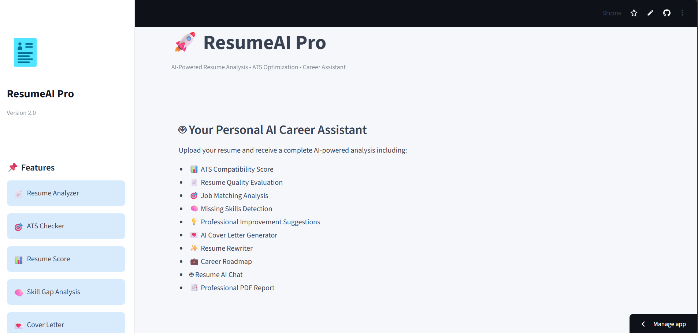

# 🚀 ResumeAI Pro

<p align="center">


</p>

<p align="center">

An AI-powered Resume Analyzer & Career Assistant that helps job seekers optimize their resumes using Google Gemini AI.

</p>

---

# 📖 Overview

ResumeAI Pro is an intelligent web application that analyzes resumes using Large Language Models (Google Gemini AI) and provides professional feedback to improve hiring opportunities.

The application evaluates ATS compatibility, identifies missing skills, measures resume quality, generates professional cover letters, rewrites resumes, provides career guidance, creates interview questions, and exports comprehensive PDF reports.

---

# 📸 Application Preview

## 🏠 Home

<p align="center">
  
</p>

---

## 📄 Upload Resume

<p align="center">
  
</p>

---

## 📊 Dashboard

<p align="center">
  
</p>

---

## 🧠 Skills Analysis

<p align="center">
  
</p>

---

## 📈 Analytics

<p align="center">
  
</p>

---

## 💌 Cover Letter Generator

<p align="center">
  
</p>

---

## ✨ Resume Rewriter

<p align="center">
  
</p>

---

## 💼 Career Advisor

<p align="center">
  
</p>

---

## 🤖 Resume Chat

<p align="center">
  
</p>

---

# ✨ Features

✅ Resume Analysis

✅ ATS Compatibility Score

✅ Resume Quality Score

✅ Job Match Analysis

✅ Grammar Evaluation

✅ Formatting Analysis

✅ Keyword Analysis

✅ Hard Skills Detection

✅ Soft Skills Detection

✅ Missing Skills Analysis

✅ Professional Resume Summary

✅ AI Hiring Decision

✅ AI Resume Rewriter

✅ AI Cover Letter Generator

✅ LinkedIn Summary Generator

✅ AI Career Advisor

✅ Resume AI Chat Assistant

✅ Professional PDF Report

✅ Analysis History

---

# 🛠 Tech Stack

| Category | Technologies |
|----------|--------------|
| Language | Python |
| Framework | Streamlit |
| AI Model | Google Gemini |
| PDF Parsing | PDFPlumber |
| DOCX Parsing | python-docx |
| Charts | Plotly |
| PDF Reports | ReportLab |

---

# 📂 Project Structure

```text
ResumeAI-Pro/
│
├── components/
│   ├── charts.py
│   ├── dashboard.py
│   ├── decision.py
│   ├── interview.py
│   ├── metrics.py
│   ├── reviews.py
│   └── skills.py
│
├── assets/
├── images/
│
├── analyzer.py
├── app.py
├── career_advisor.py
├── config.py
├── cover_letter.py
├── history.py
├── history.json
├── linkedin_summary.py
├── parser.py
├── prompts.py
├── report.py
├── requirements.txt
├── results.py
├── resume_chat.py
├── rewrite.py
├── ui.py
├── utils.py
└── README.md
```

---

# ⚙️ Installation

## Clone the repository

```bash
git clone https://github.com/0115455/ResumeAI-Pro.git
```

---

## Open the project

```bash
cd ResumeAI-Pro
```

---

## Install dependencies

```bash
pip install -r requirements.txt
```

---

## Create a .env file

```env
GEMINI_API_KEY=YOUR_API_KEY
```

---

## Run the application

```bash
streamlit run app.py
```

---

# 📊 Application Modules

- Resume Parser
- Resume Analyzer
- ATS Checker
- Resume Score Calculator
- Job Matching
- Skills Analyzer
- Resume Rewriter
- Cover Letter Generator
- LinkedIn Summary Generator
- Career Advisor
- Interview Questions
- Resume Chat Assistant
- PDF Report Generator
- Analysis History

---

# 💡 AI Capabilities

The project utilizes Google Gemini AI to:

- Analyze resume quality
- Calculate ATS compatibility
- Compare resumes with job descriptions
- Detect missing skills
- Generate professional cover letters
- Rewrite resumes
- Generate LinkedIn summaries
- Provide career recommendations
- Answer resume-related questions

---

# 📈 Future Improvements

- Multi-language Resume Support
- CV Templates
- LinkedIn Resume Import
- Portfolio Analysis
- AI Mock Interviews
- Resume Ranking
- Company-specific ATS Optimization
- Resume Version Comparison

---

# 👨‍💻 Developer

## Mohammed Wael

**AI Developer | Mechatronics Engineer**

---

# 📬 Contact

GitHub

https://github.com/PhantomMW

---

# ⭐ Support

If you found this project useful, consider giving it a ⭐ on GitHub.

---

# 📄 License

This project was developed for educational and portfolio purposes.
